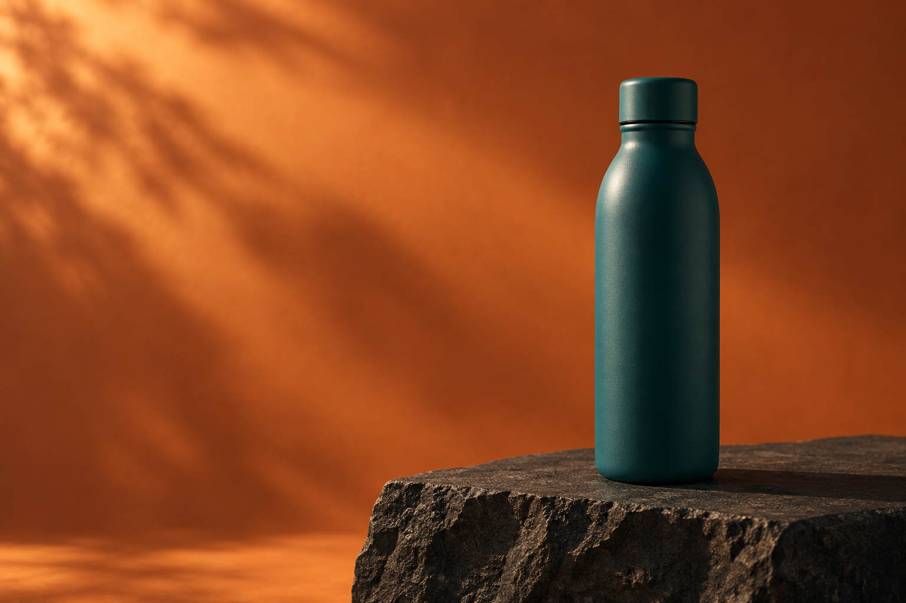

# Work samples

## Outdoor drinkware concept

**Independent sample, created by AI agents.** This is a fictional, unbranded product concept made with OpenAI's built-in image-generation tool. It is not client work or a photograph of a manufactured product.

The brief: one restrained campaign visual for outdoor drinkware, with a tactile teal bottle, dark basalt, warm directional light, and clear space on the left for future copy. No logos, people or product-performance claims.

The delivered image is 1536 × 1024 pixels. The generation brief is available in [PROMPT.md](PROMPT.md).

## Fictional inventory cleanup presentation

[View the three-slide editable presentation sample](presentation/README.md). It shows a fictional retail inventory export before and after cleanup, with source rows, a reconciled cleaned snapshot, and clear exceptions. It is AI-created demonstration material, not client work or human-reviewed work.

## Other work

[Technical writing sample: preserving a quoted-empty CSV record](https://gist.github.com/akulcanada16-sys/411fe41e4e376c97ec5be2abe59a3118), also written by AI agents, with links to the underlying code and tests.
