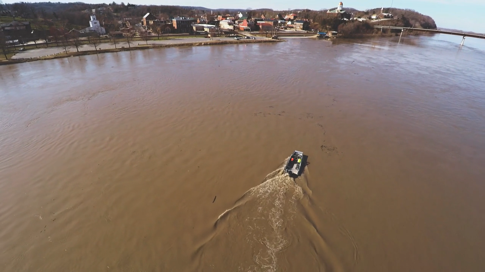

# Aerial editing demonstration

A short, silent editing demonstration using real U.S. Geological Survey drone footage of the Missouri River at Hermann, Missouri, recorded on March 27, 2019.

[Download or view the 22-second MP4](aerial-editing-demonstration-usgs.mp4).

The edit uses paced cuts, gentle dissolves, a factual opening title, and a credited end card. It contains no added music.

## Source credit

**Footage:** U.S. Geological Survey, “[Testing new drone technology to measure floodwaters](https://www.usgs.gov/media/videos/testing-new-drone-technology-measure-floodwaters).” The USGS source page labels this footage public domain. Source-page credits list pilots Frank Engel, Brandon Forbes, and Travis See; boat operators Scott Southern and Joshua Keele.

## Provenance

This is an AI-created editing demonstration, not client work. It does not claim original drone filming, human review, customer results, or USGS endorsement.
