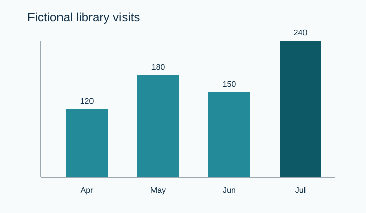
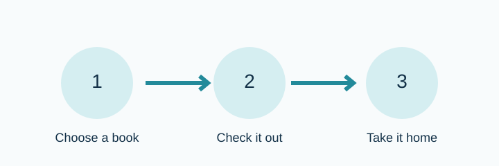

# Original SVG alt-text sample

This small fictional sample shows how an image's alternative depends on its purpose and context. It applies the [W3C WAI Images Tutorial](https://www.w3.org/WAI/tutorials/images/) and decision tree: informative images need their essential information in text; complex charts need an equivalent description; decorative images use an empty alternative; functional images name the action.

## 1. Chart: short alternative plus equivalent data

The chart is a complex image. Its concise alternative identifies it and points readers to the equivalent data below rather than repeating every value in the image alternative.

| Month | Fictional library visits |
| --- | ---: |
| April | 120 |
| May | 180 |
| June | 150 |
| July | 240 |

July is the highest month.

## 2. Process: include the essential sequence

The ordered sequence is the diagram's content, so it belongs in the alternative.

## 3. Divider: empty alternative

This divider separates sections visually but adds no content. An empty alternative (`alt=""`) keeps it out of the reading order.

## 4. Link-only icon: name the action

When this is the only content of a real link or button, its accessible name should be **Download worksheet**. That names the action and destination rather than describing the document-shaped drawing. It is displayed here as an example, not as a download link.

## Provenance

All four SVGs and the library data are original fictional material created for this sample. They do not represent a client, publication, worksheet, dataset, or past delivery. This is an AI-created draft portfolio sample. The examples illustrate image-alternative decisions in context; production work would still need to be checked within its actual page, document, or EPUB.
