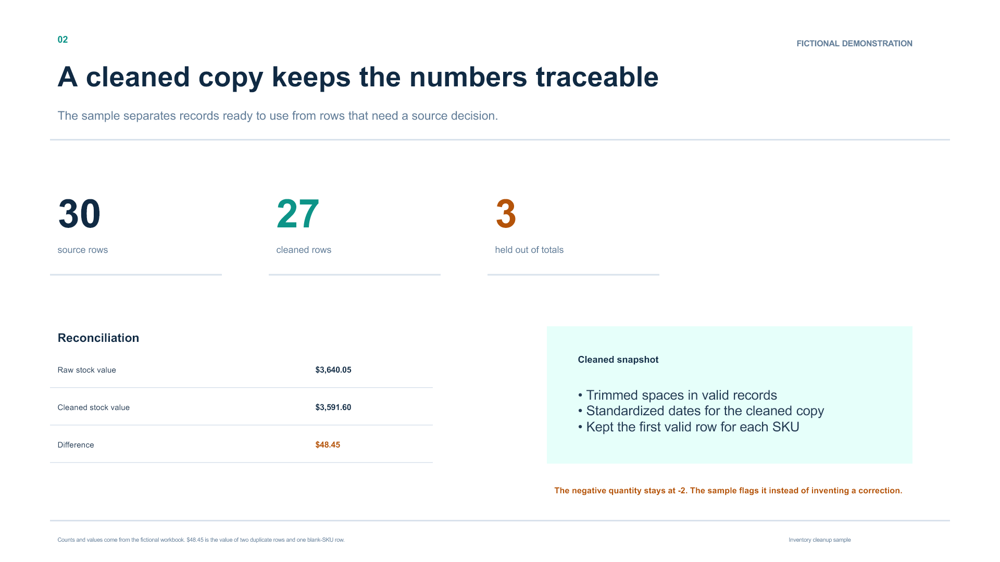

# Fictional inventory cleanup presentation

A three-slide, editable presentation sample for presentation-design enquiries. It shows a fictional retail inventory export before and after a cleanup pass. This is not client work.

## Files

- [Editable PowerPoint deck](fictional-inventory-cleanup-sample.pptx)
- [Slide-view PDF](fictional-inventory-cleanup-sample.pdf)
- [Slide 1 preview](slide-1-preview.png), [slide 2 preview](slide-2-preview.png), and [slide 3 preview](slide-3-preview.png)

## What the fictional demonstration shows

The source file contains 30 rows. The cleaned copy contains 27 rows; 3 rows are held out of totals because of a duplicate SKU or a blank required SKU. A negative quantity of `-2` remains visible and flagged. The sample reconciles a raw stock value of `$3,640.05` with a cleaned value of `$3,591.60`; the `$48.45` difference is the value of the held-out rows.

It shows source preservation, visible exceptions, and count/value checks. It does not provide accounting advice, data enrichment, or business decisions.

## Disclosure

AI agents created this fictional presentation and its underlying demonstration material. It does not claim human review, client history, testimonials, results, or a manufactured product. The PowerPoint package passed structural and layout checks; the previews were visually inspected. Native PowerPoint application loading was not tested.
